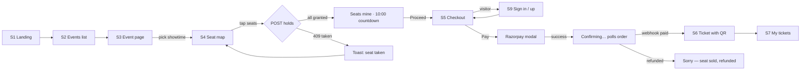
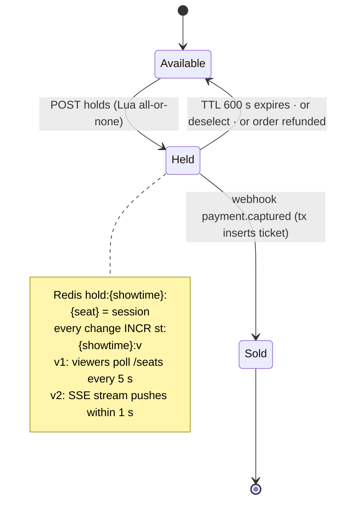
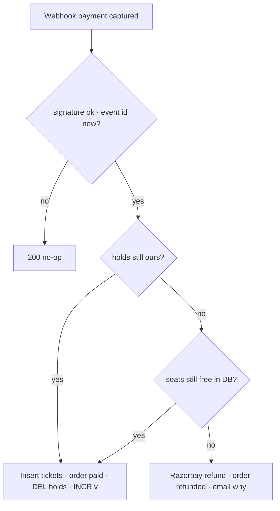
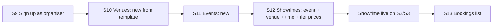
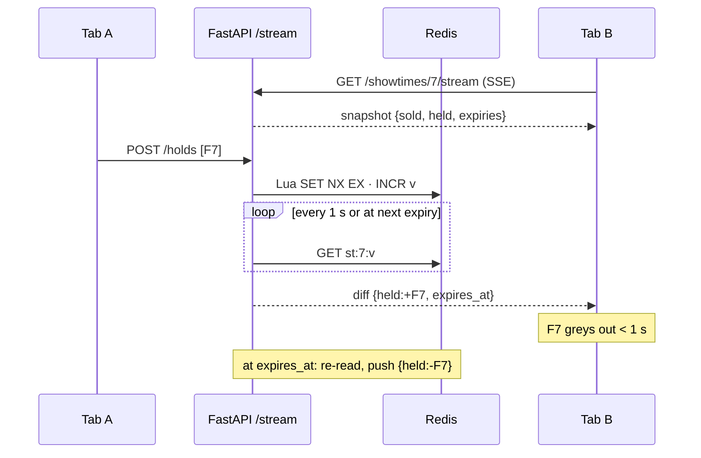
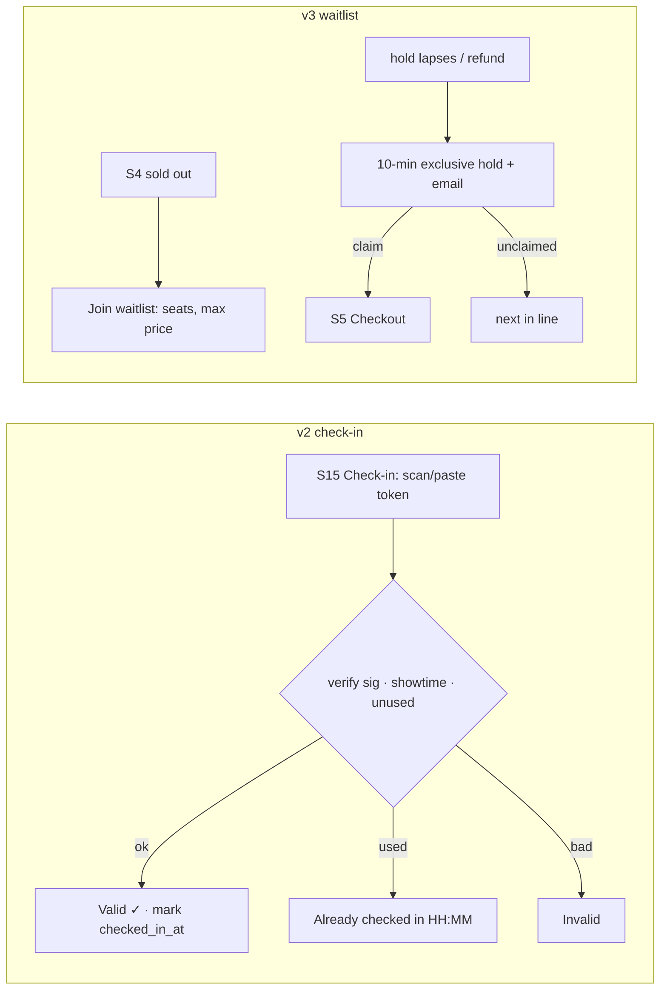

# Frontrow — User Flows & Screen Index

**Lifecycle step:** 3 of 17 · **Locked:** 2026-09-15 · Pairs with [03-requirements.md](03-requirements.md); every screen below gets a mockup in [04-ui-mockups.md](04-ui-mockups.md).

## Flow 1 — Book seats (v1, the main path)

## Flow 2 — Hold lifecycle (v1 rules, v2 visibility)

## Flow 3 — Paid after hold expired (v1)

## Flow 4 — Organiser creates a bookable show (v1)

## Flow 5 — Live hall (v2)

## Flow 6 — Check-in (v2) and Waitlist (v3)

## Screen index

| # | Screen | Route | Who | Version | Notes |
|---|---|---|---|---|---|
| S1 | Landing | `/` | visitor | v1 | Exists; gains real "Now showing" strip + demo logins |
| S2 | Events list | `/events` | visitor | v1 | Filters in URL |
| S3 | Event page | `/events/[slug]` | visitor | v1 | Showtimes by day → venue, fill indicator |
| S4 | Seat map | `/book/[showtimeId]` | visitor/customer | v1 · live in v2 | The signature screen; 3 templates; countdown |
| S5 | Checkout | `/checkout/[orderId]` | customer | v1 | Inline sign-in; Razorpay modal; confirming state |
| S6 | Ticket | `/tickets/[orderId]` | customer | v1 | QR per seat; calendar link |
| S7 | My tickets | `/my-tickets` | customer | v1 | Upcoming / past |
| S8 | Refunded / failed order | `/checkout/[orderId]` state | customer | v1 | Paid-after-expiry explanation |
| S9 | Sign in / Sign up | `/sign-in`, `/sign-up` | all | v1 | Role picker on sign-up; demo buttons |
| S10 | Organiser · Venues | `/organiser/venues` | organiser | v1 | Template picker + knobs; layout preview |
| S11 | Organiser · Events | `/organiser/events` | organiser | v1 | Form + list |
| S12 | Organiser · Showtimes | `/organiser/showtimes` | organiser | v1 | Tier prices; cancel guard |
| S13 | Organiser · Bookings | `/organiser/bookings/[showtimeId]` | organiser | v1 | Paid orders; CSV |
| S14 | Organiser · Dashboard | `/organiser/dashboard` | organiser | v2 | Live revenue/occupancy, mini maps |
| S15 | Check-in | `/checkin/[showtimeId]` | organiser | v2 | Camera or paste |
| S16 | Waitlist join + offer | `/book/[showtimeId]` state · email link | customer | v3 | |
| S17 | Transfer ticket | `/tickets/[orderId]` action · claim page | customer | v3 | |
| S18 | Organiser · Heatmap | `/organiser/venues/[id]/heatmap` | organiser | v3 | |
